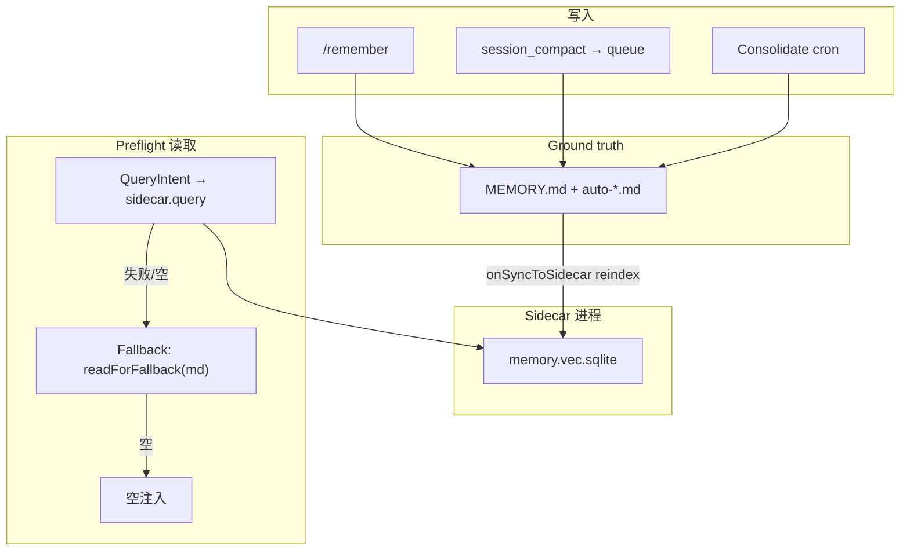

# 从 Kocoro 到 Pi Agent：一次本地记忆设计的探索与落地指南

> 本文记录对 Kocoro episodic memory 的逆向阅读与讨论，以及如何把这些想法「翻译」成 Pi coding agent 上可实现的 Sidecar 本地记忆方案。  
> 配套设计文档：[sidecar-local-memory-design.md](./sidecar-local-memory-design.md) ·  Kocoro 笔记：[kocoro-memory.md](./kocoro-memory.md)

---

## 为什么要研究 Kocoro 的记忆

Pi agent 把对话存成 JSONL session，用 [compaction](https://pi.dev/docs/latest/compaction) 在**同一个 session 内**续 context——这解决的是「聊太长了怎么办」，不是「新开一个 session 还记得我是谁」。

Kocoro 的 episodic memory 正好补这个洞：**跨 session 的长期事实**（偏好、项目约定、关键决策、待办），在每条用户消息进主模型之前自动检索注入。

我们做的不是照搬 Go 实现，而是问三个问题：

1. Kocoro 哪些机制是**本质**（必须保留语义）？
2. 哪些是它家栈的**实现选择**（Cloud bundle、tlm 二进制）可以替换？
3. Pi 已有什么（compaction、extension 事件、pi-session-search）可以**复用**，避免重复造轮子？

---

## Kocoro 记忆架构：先分两层

Kocoro 文档里写得很清楚：记忆分**本地 episodic** 和 **云端 supervisor**，至今未打通。

```
本地 (shan daemon)                 Shannon Cloud（暂不落地）
─────────────────────              ─────────────────────────
MEMORY.md  ← 有界写入              PostgreSQL：task/agent 执行记录
  ↓ overflow                         Redis：session 缓存
ConsolidateMemory ← LLM 整理         Qdrant：6 collections 向量库
  ↓                                  （workflow 编排用的 supervisor memory）
Sidecar (tlm) ← UDS 检索
  ↓
Preflight ← 每条消息前自动注入
```

**本地**管「用户和 Agent 的长期便签」；**云端**管「多 Agent workflow 怎么干得更好」——是执行平台上的经验检索，不是 MEMORY.md 的镜像。

对 Pi 方案而言：**只实现左边这一半**就够了。Cloud、bundle pull、tlm 二进制都可以放下。

---

## 五个值得带走的 Kocoro 设计

### 1. MEMORY.md 是有界便签，不是聊天备份

150 行硬上限，溢出到 `auto-*.md`，定期 Consolidate 合并回主文件。记的是 **Preferences / Conventions / Findings / Todos**，不是「今天在干嘛」的流水账。

Ground truth 在 md；Sidecar 里的向量索引只是**派生数据**——索引 lag 时仍可以直读 md 兜底。

### 2. Preflight：对话前的自动检索，且不污染 session

这是 Kocoro 相对其他 agent 的差异化：

```
用户消息
  → 小模型提取 QueryIntent
  → buildRetrievalQuery（纯函数，在 daemon 侧）
  → Sidecar 向量检索
  → 有结果则前缀 <private_memory>...</private_memory> 到 user message
  → 持久化 session 时仍用**原始** userInput（不含 private_memory）
```

记忆是**增强层**：Sidecar 挂了也不报错，走 Fallback，主对话照常。

### 3. Sidecar：重活隔离，不是「另一个 Agent」

索引加载、embed、向量搜索、MMR 重排——放在独立进程，UDS + **JSONL** 通信。Daemon 负责 spawn、ping/pong 就绪检测、graceful shutdown。

Sidecar **不写** MEMORY.md，**不**解析 QueryIntent；只收 plain query string，返回 `MemoryEntry[]`。

### 4. 写入不是一条路

| 路径 | 作用 |
|------|------|
| **memory_append** | 底层有界追加（溢出机制） |
| **PersistLearnings** | 压缩前从对话提炼事实（Kocoro 同步） |
| **ConsolidateMemory** | LLM 垃圾回收：去重、删过期 TODO、收拢 overflow |

Pi 上我们改成了三条更清晰的触发线（见下文）。

### 5. MMR 与分块在应用层，不在向量库魔法里

- **Chunking（MVP）**：**1 Memory Entry = 1 vector chunk**（`chunk_id = entry.id`）。Kocoro 式 ~2000 token 分块见设计文档 §11 Backlog。
- **MMR**：检索时先取 K×3 候选，λ=0.7 平衡相关性与多样性，避免 5 条结果全讲同一件事。

本地 MVP 用 **better-sqlite3 + 全表 cosine 扫描**，MMR 在 TypeScript 应用层实现——不是 sqlite-vec ANN 魔法。

---

## 和 Pi 的分工：别重复造 compaction

| 问题 | Pi 负责 | 我们的 MEMORY 负责 |
|------|---------|------------------|
| 长 session context 爆了 | `CompactionEntry` + Session Context | 不碰 |
| 新开 session 忘记偏好/约定 | 默认不带旧 compact | Preflight + MEMORY.md |
| 用户显式「记住这个」 | 无 | `/remember` slash |
| 搜几百条历史 session | pi-session-search（扩展） | 不重复建 FTS5 |

Pi compaction 时用户本来就要等**一次** summary LLM。我们的做法是：**自定义 dual-purpose summary**，一次调用同时服务「本 session 续聊」和「跨 session Memory Export」——不在 compact 后再跑第二条 memory LLM。

```markdown
## Session Context
<!-- 本 session 续聊 -->

## Memory Export
### Preferences
### Conventions
### Findings
### Todos
```

`session_compact` 事件里 **fire-and-forget** `appendFromCompaction`；规则解析 `Memory Export` → `appendIfAbsent`——**不堵**聊天热路径。

---

## Pi 落地架构（Sidecar + memory.vec.sqlite）

我们**不要** Kocoro 的 tlm + Cloud bundle，改为本地闭环：



**技术选型摘要：**

| 层级 | 选择 |
|------|------|
| 向量 | better-sqlite3 + JS cosine（`memory.vec.sqlite`） |
| Session 搜索 | pi-session-search（独立 FTS5，不进 sidecar DB） |
| 进程 | spawn / execa + UDS JSONL |
| 文件 | MemoryStore 抽象；proper-lockfile |
| 校验 | Zod + QueryIntent 最多 1 retry |

---

## 三条 MEMORY 写入链路（Pi 版）

**1. `/remember`** — 用户显式写入，同步 append，无 LLM，`[user]` 条目 Consolidate 不可删。

**2. Session compaction** — `session_before_compact` 生成 dual-purpose summary；`session_compact` → `appendFromCompaction`；subagent 走 **Compact Delta**。

**3. Consolidate** — `auto-*.md ≥ 12` **或** 距上次 GC ≥ 7 天 **或** 每日 03:00（**OR** 关系）；LLM merge → `rewrite` → `sidecar.reindex`。

**Shutdown Queue（元数据）** — `session_shutdown` 追加 `.memory_shutdown_queue.jsonl`（session 路径、parent、reason）；不做 LLM，为 offline worker 预留。

读路径 **Preflight**（Root session）：

1. `session_start` → 预加载 **Memory Cap**（`readForFallback` → `sessionMemoryCap`）
2. 每轮 `before_agent_start` → **Episodic Preflight**（QueryIntent → sidecar）+ `mergePrivateMemoryBlocks(cap, episodic)`
3. `shouldRunEpisodicPreflight` 门控：短句 / slash / 无 memory cue 可跳过；**首条 force**
4. `context` → 注入 `<private_memory>`；复用 `turnPreflight` 缓存

Subagent：仅 **Memory Cap**；写路径见 Compact Delta + Shutdown Queue（设计文档 §4.3）。

---

## 与 Kocoro 的关键差异（刻意为之）

| Kocoro | Pi 方案 |
|--------|---------|
| PersistLearnings compact **前**同步 | custom summary + **session_compact 异步** |
| Sidecar 读 Cloud **bundle** | 本地 **onSyncToSidecar → reindex** |
| daemon 内置 session **FTS5** | **pi-session-search** 扩展 |
| Fallback **四层** | **Sidecar → md → 空** |
| Consolidate ≥12 **且** ≥7 天 | **OR** + 每日 03:00 |
| tlm 二进制 | Node Sidecar 脚本 |
| Subagent Preflight | 未区分 | **cap only**（§4.3）；写路径 **Compact Delta** + shutdown metadata queue |

Subagent 读/写策略详见设计文档 [sidecar-local-memory-design.md §4.3](./sidecar-local-memory-design.md).

---

## 实现顺序（MVP 指南）

若你要在 Pi extension 里动手，建议按依赖顺序来：

1. **`store/paths`** + **MemoryStore** / Markdown 后端（append、overflow、锁）
2. **Sidecar**：UDS server + `memory.vec.sqlite` `query` / `reindex`
3. **SidecarManager**：spawn、ping/pong、shutdown
4. **Preflight** + Fallback（Sidecar → md → 空）
5. Pi extension：`session_before_compact` + `session_compact` + `appendFromCompaction`
6. **`/remember`**
7. **Consolidate**：24h interval + OS cron CLI（`pi-memory consolidate --cron`）

垂直切片验收标准：**新开 session 问「测试框架用什么」**，Preflight 能注入 MEMORY 里的 Vitest 约定；Sidecar 进程 kill 后仍能靠 md Fallback 或空注入正常对话。

---

## 常见误区（讨论里踩过的坑）

**Sidecar 挂了要提示用户「记忆服务不可用」？**  
否。Kocoro 哲学是 best-effort 静默降级；记忆不是硬依赖。

**Preflight 注入写进 session 吗？**  
否。`<private_memory>` 只在 in-flight user message 里；JSONL 存原文。

**MEMORY.md 是工作日志吗？**  
否。是跨 session 便签；过程细节在 session / pi-session-search。

**需要再建一套 session FTS5 吗？**  
否。pi-session-search 已有；sidecar DB 只管 vec 索引。

**sqlite-vec 会比 tlm bundle 慢吗？**  
在单机几千～几万向量量级，瓶颈通常在 **embed API**，不是本地 ANN。Sidecar 的价值是进程隔离，不是 bundle 魔法。

---

## 后续优化（Backlog，非 MVP）

设计文档 §11 单独记录了讨论过、但**不纳入 MVP 目标**的项，例如：

- Preflight 预算从 ~5s 收到 1.5～2s（skip intent、0 retry）
- Sidecar query 缓存（`indexGeneration` + LRU，**已实现**）
- 本地 embed、增量 reindex、分段 metrics

MVP 跑通后再用 p99 和 recall 抽样决定是否做。

---

## 一句话带走

> **MEMORY.md 是 Ground Truth；Sidecar 是 memory.vec.sqlite 检索进程；Preflight 读（Root：Memory Cap + Episodic）；写走 /remember、compact Compact Delta、consolidate；失败静默降级。**

术语表：[UBIQUITOUS_LANGUAGE.md](./UBIQUITOUS_LANGUAGE.md)

---

## 参考

- 本仓库：[kocoro-memory.md](./kocoro-memory.md)（Kocoro 逆向笔记）
- 本仓库：[sidecar-local-memory-design.md](./sidecar-local-memory-design.md)（Pi 落地设计全文）
- Pi：[Compaction 文档](https://pi.dev/docs/latest/compaction)
- Pi 生态：[pi-session-search](https://github.com/cartwmic/pi-session-search)（session 全文 / hybrid 搜索扩展）

---

*写于 2026-07。若实现进展与本文有出入，以 `sidecar-local-memory-design.md` 为准。*
